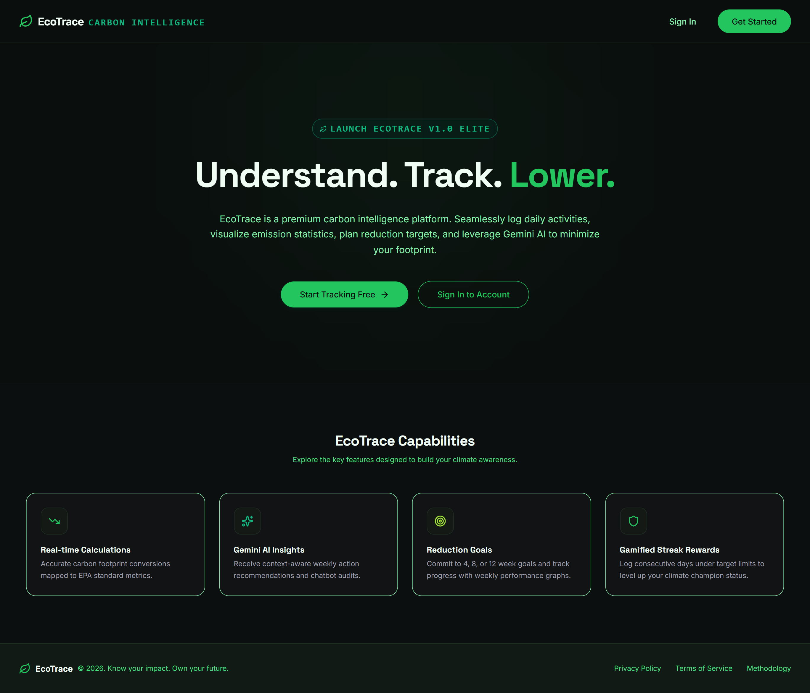
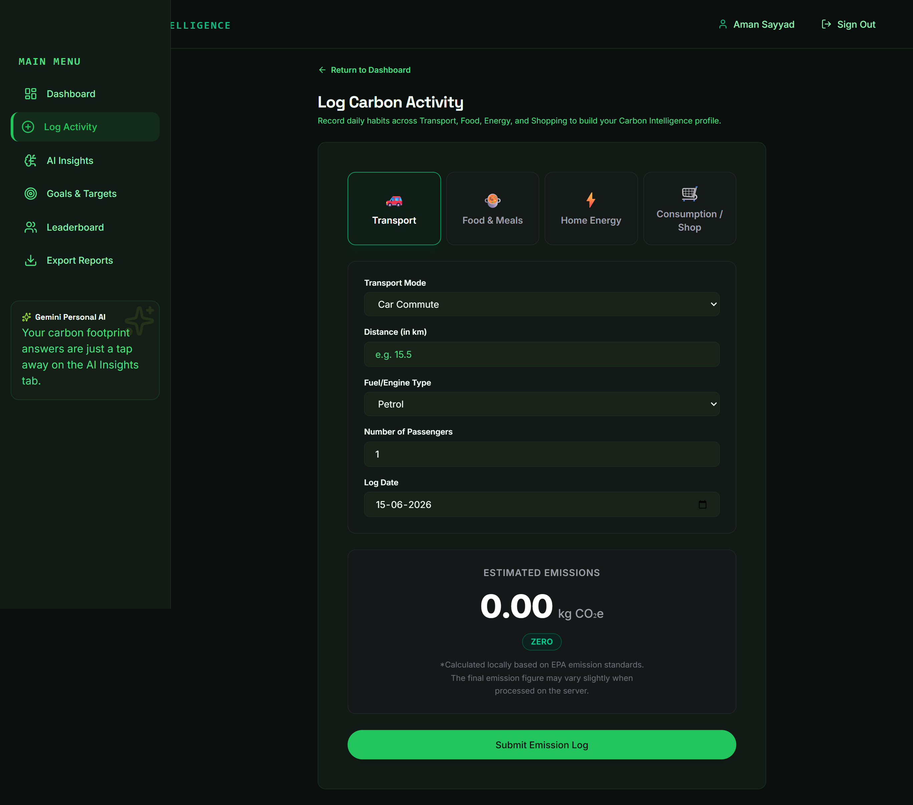
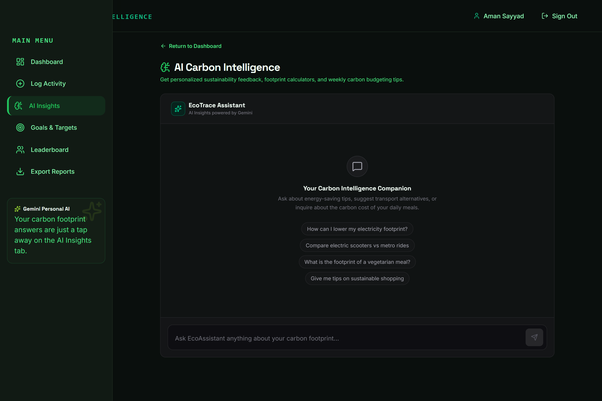

# EcoTrace — Personal Carbon Intelligence Platform

EcoTrace is a premium carbon tracking and sustainability platform. It helps users log daily habits, visualize carbon budgets, commit to reduction goals, compare performance benchmarks against community averages, and receive personalized feedback via Gemini AI.

---

## Visual Overview

### 🌅 Premium Landing Page


### 📝 Carbon Logging Console & Live Preview


### 🤖 Gemini AI Sustainability Advisor


---

## Technical Architecture

EcoTrace is divided into three primary modules:
1. **Next.js 14 Frontend:** App Router React dashboard styled with Tailwind CSS v4, visualizing metrics using Recharts and animating interactions with Framer Motion.
2. **Node.js Express Backend:** Containerized REST server with validation (Zod), rate-limiting, and Vertex AI SDK bindings for Gemini 1.5 Pro stream chat feedback.
3. **Cloud Functions (Workers):** Schedules to process weekly digests, sync emission references, and send goal nudge notifications.

Detailed documentation is available in:
- [System Architecture Specification](docs/ARCHITECTURE.md)
- [API Reference Manual](docs/API.md)
- [Carbon Emission Calculation Methodology](docs/EMISSION_METHODOLOGY.md)

---

## Getting Started

### Prerequisites
- Node.js 20 or higher
- Docker & Docker Compose (for containerized setup)
- Firebase CLI (for emulator controls)

### 1. Local Development Setup (Quick Start)

Run the entire suite locally using Docker Compose, which coordinates the Firebase Emulator, Express Backend, and Next.js Frontend:

```bash
docker-compose up --build
```

Access the systems:
- **Next.js PWA:** [http://localhost:3000](http://localhost:3000)
- **Express REST Server:** [http://localhost:8080](http://localhost:8080)
- **Firebase Emulator Console:** [http://localhost:4000](http://localhost:4000)

### 2. Manual Development Running

#### Start Backend
```bash
cd backend
npm install
npm run dev
```

#### Start Frontend
```bash
cd ../frontend
npm install
npm run dev
```

---

## Test & Validation Suites

### Backend Unit & Integration Tests
Run 29+ Jest test cases with mock assertions covering JWT decoders, rate-limiters, calculations, and chatbot streams:
```bash
cd backend
npm run test
```

### Frontend Checks
Run linting, formatting, type checking, and component test suites:
```bash
cd ../frontend
npm run test
npm run lint
```
